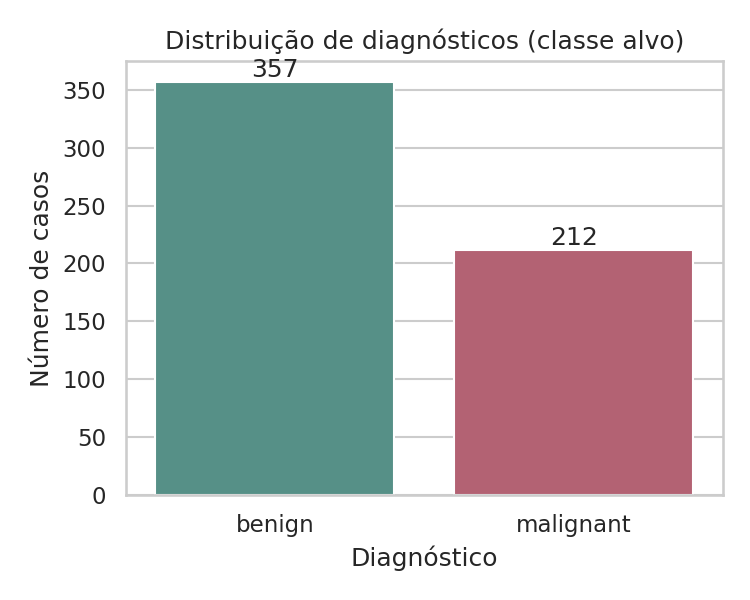
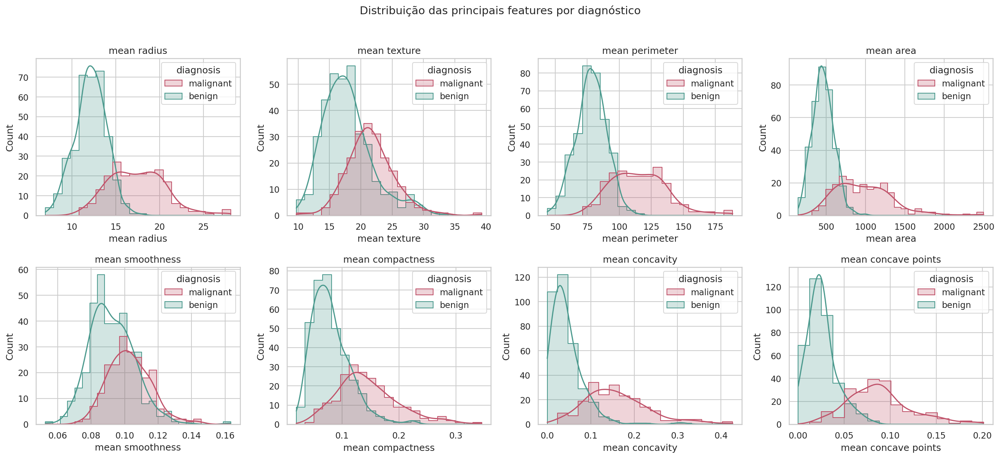
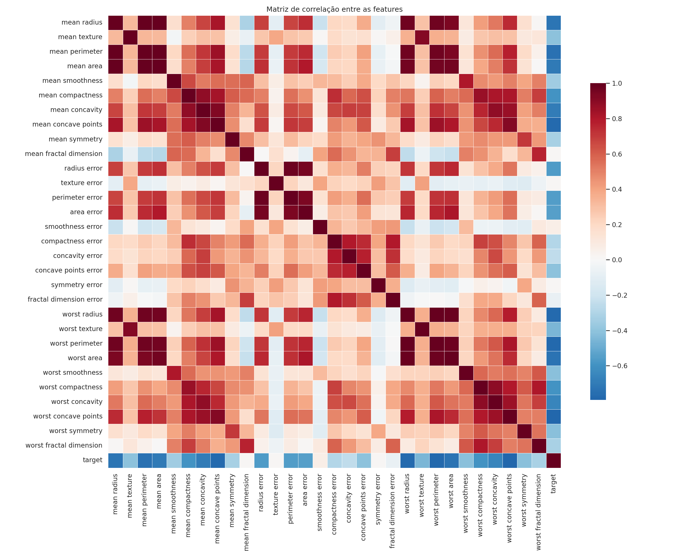
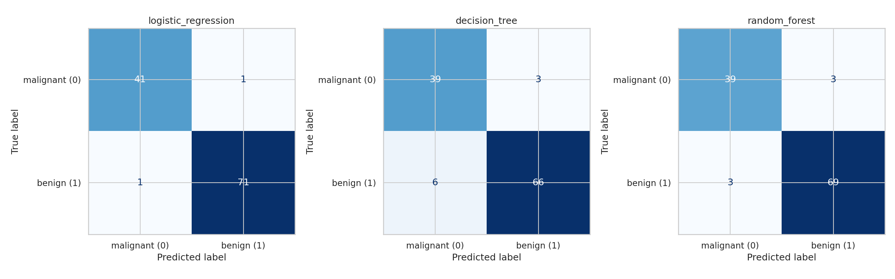
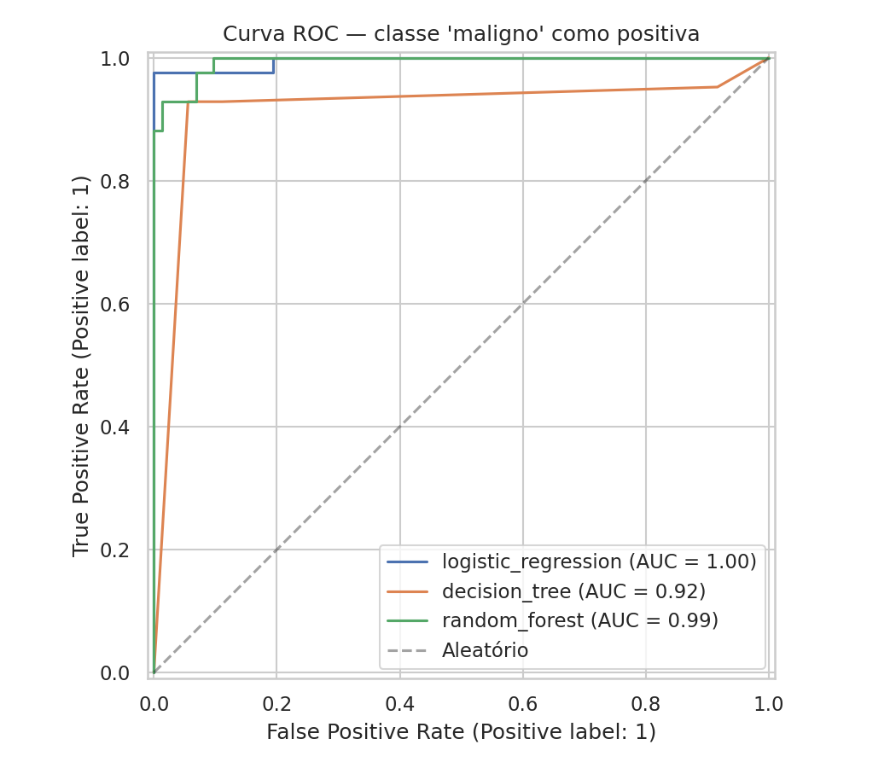
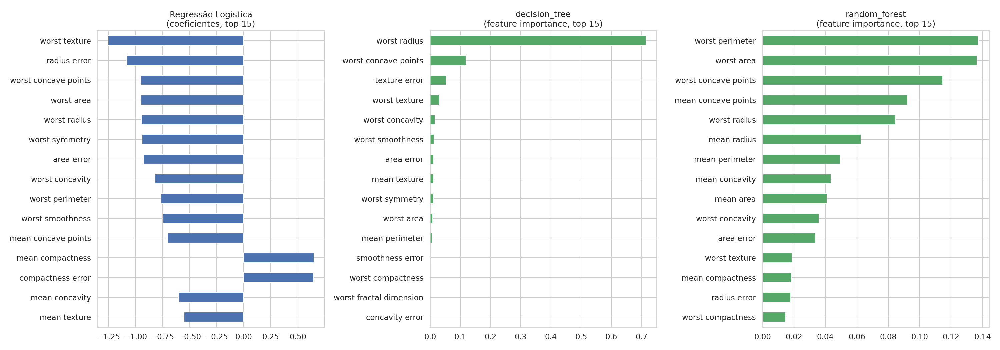

\newpage

# 1. Entregáveis

**Link do repositório Git:**
[https://github.com/PedroBonacelli/feature-fase-1](https://github.com/PedroBonacelli/feature-fase-1)

O repositório contém: código-fonte completo (`src/`), `README.md` com
instruções de execução, `Dockerfile`, instruções de obtenção do dataset
(`data/raw/README.md`), todos os resultados (`reports/figures/`) e este
relatório técnico completo (`reports/RELATORIO_TECNICO.md`).

**Vídeo de demonstração:** *[link a ser adicionado após a gravação —
ver `reports/03_cnn_extra.md` e README para o estado atual do projeto]*

\newpage

# 2. O Problema e o Dataset

Uma rede de hospitais e centros de saúde especializados no atendimento à
mulher busca implementar um sistema inteligente de suporte ao diagnóstico e
detecção de riscos, capaz de ajudar profissionais de saúde na identificação
precoce de condições que afetam a segurança e saúde feminina. Nesta Fase 1,
o desafio é construir a base desse sistema com foco em Machine Learning
sobre dados médicos estruturados.

**Dataset utilizado:** Breast Cancer Wisconsin (Diagnostic) — 569 exames,
30 features numéricas derivadas de imagens digitalizadas de biópsias por
agulha fina (FNA), organizadas em três grupos (`mean`, `error`, `worst`)
para 10 medidas de forma/textura do núcleo celular. Fonte:
[kaggle.com/datasets/uciml/breast-cancer-wisconsin-data](https://www.kaggle.com/datasets/uciml/breast-cancer-wisconsin-data)
(carregado via `sklearn.datasets.load_breast_cancer`, mesma base, origem UCI
Machine Learning Repository).

Variável alvo: `target` (0 = maligno, 1 = benigno). Distribuição: **357
benignos (62,7%) / 212 malignos (37,3%)**.

\newpage

# 3. Análise Exploratória de Dados (EDA)

O dataset está limpo: **zero valores ausentes, zero duplicatas**. Há
separação visual clara entre malignos e benignos em features de tamanho e
irregularidade de contorno, coerente com o conhecimento clínico sobre
morfologia tumoral.

{width=45%}

{width=100%}

Há forte multicolinearidade entre medidas de tamanho (`radius`, `perimeter`,
`area` — correlação > 0,98 entre pares), o que é esperado matematicamente e
orientou decisões de modelagem.

{width=100%}

\newpage

# 4. Pré-processamento

1. Limpeza defensiva (duplicatas, imputação por mediana, descarte de
   medidas fisicamente inválidas) — 0 registros afetados neste dataset.
2. Separação treino/teste estratificada (80/20 → 455/114 amostras),
   preservando a proporção de ~37% de malignos.
3. Escalonamento (`StandardScaler`) ajustado somente no treino, evitando
   vazamento de dados.
4. Análise de correlação confirmou 15 pares de features com correlação
   > 0,95 — decisão de manter todas as features, contando com
   regularização e robustez dos modelos à multicolinearidade.

\newpage

# 5. Modelagem

Três técnicas de classificação foram treinadas e comparadas:

| Modelo | Justificativa |
|---|---|
| Regressão Logística | Baseline linear, altamente interpretável |
| Árvore de Decisão (`max_depth=5`) | Não-linear, fácil de visualizar/explicar |
| Random Forest (300 árvores) | Ensemble mais robusto, comparação mais forte |

**Métrica de avaliação escolhida:** recall e F1 da classe **maligno**, não
apenas accuracy — em um dataset com desbalanceamento moderado (63%/37%), um
modelo que sempre previsse "benigno" já teria ~63% de acurácia sem detectar
nenhum câncer. Um falso negativo (câncer classificado como benigno) é o
erro mais grave clinicamente.

\newpage

# 6. Resultados

Métricas no conjunto de **teste** (114 amostras nunca vistas no treino):

| Modelo | Accuracy | Precision (maligno) | Recall (maligno) | F1 (maligno) | ROC AUC | Falsos negativos |
|---|---|---|---|---|---|---|
| **Regressão Logística** | **0,983** | 0,976 | **0,976** | **0,976** | **0,995** | **1** |
| Árvore de Decisão | 0,921 | 0,867 | 0,929 | 0,897 | 0,916 | 3 |
| Random Forest | 0,947 | 0,929 | 0,929 | 0,929 | 0,994 | 3 |

A **Regressão Logística** obteve o melhor resultado — maior recall e F1 na
classe maligno, maior AUC, e apenas 1 falso negativo. O Random Forest teve
100% de acurácia no treino mas ficou atrás no teste, indício de leve
overfitting.

{width=100%}

{width=70%}

## Explicabilidade

Três camadas de interpretação foram aplicadas: feature importance nativa,
permutation importance (model-agnostic) e uma explicação tipo-SHAP para a
Regressão Logística (fórmula analítica exata do SHAP para modelos
lineares — `phi_i = coef_i · (x_i − média_treino_i)` — implementada
manualmente, pois o pacote `shap` não pôde ser instalado no ambiente
sandbox usado para este desenvolvimento).

{width=100%}

As três abordagens convergem: as features mais relevantes são
consistentemente **tamanho** (`worst radius`, `worst area`, `worst
perimeter`) e **irregularidade de contorno** (`worst concave points`,
`concavity`) — convergência que reforça que o modelo aprendeu um padrão
clinicamente plausível.

\newpage

# 7. [Extra] Visão Computacional (CNN)

Um pipeline completo de CNN para diagnóstico via mamografia (dataset
CBIS-DDSM), incluindo Grad-CAM para explicabilidade visual, foi
**desenvolvido e documentado** (`src/cnn_mammography.py`), mas não
executado nesta entrega: o ambiente de desenvolvimento sandbox não tem
acesso à internet para baixar o dataset (dezenas de GB, requer autenticação
Kaggle) nem permite instalar TensorFlow. Código, arquitetura e instruções
completas de execução (Colab/local com GPU) documentados em
`reports/03_cnn_extra.md`.

\newpage

# 8. Discussão Crítica: Esse Modelo Pode Ser Usado na Prática?

**Sim, mas apenas como ferramenta de apoio à decisão — nunca como
substituto do diagnóstico médico.**

1. **O médico sempre tem a palavra final.** Mesmo com 97,6% de recall, o
   modelo ainda erra. Em produção, funcionaria como camada de
   triagem/priorização, nunca liberando um caso como "benigno" sem revisão
   humana.
2. **Dataset pequeno e de fonte única** (569 casos, um único
   processo/equipamento de coleta). Validação em dados de outras
   clínicas/equipamentos seria pré-requisito para uso clínico real.
3. **Explicabilidade é pré-requisito, não luxo**, em saúde — as camadas de
   interpretação usadas permitem que o profissional julgue se a predição
   faz sentido clinicamente.
4. **Custo assimétrico dos erros** deveria orientar o ajuste do limiar de
   decisão em produção.
5. **Próximos passos para uso real:** validação clínica prospectiva,
   auditoria de viés populacional, monitoramento contínuo pós-deploy, e um
   fluxo de trabalho onde a predição é sempre uma entre várias informações
   consideradas pelo médico.

# 9. Conclusão

A Regressão Logística treinada sobre o Breast Cancer Wisconsin atingiu
97,6% de recall e AUC de 0,995 na classe maligno, com pipeline de
pré-processamento, análise de correlação e três camadas de explicabilidade
documentadas end-to-end. O resultado valida a viabilidade técnica de um
sistema de apoio à triagem para essa tarefa, respeitando desde já o
princípio de que a decisão final é sempre do profissional de saúde.
